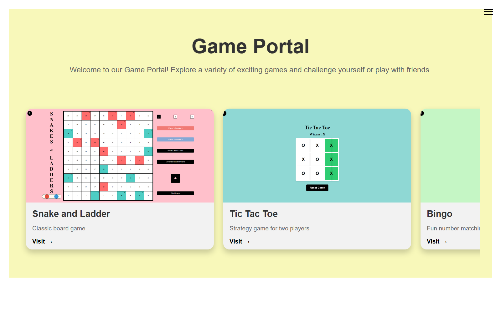
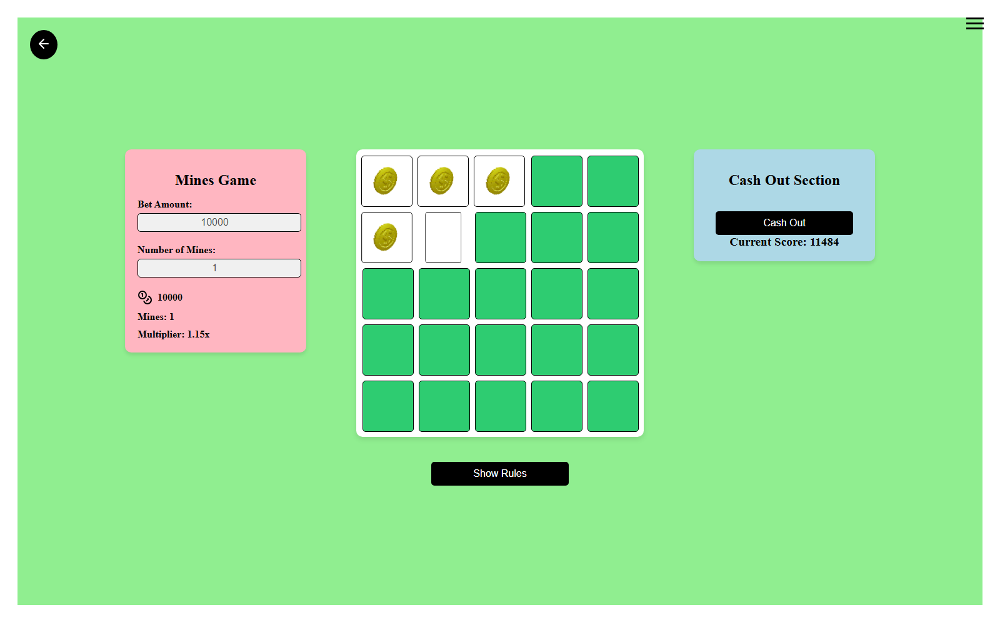
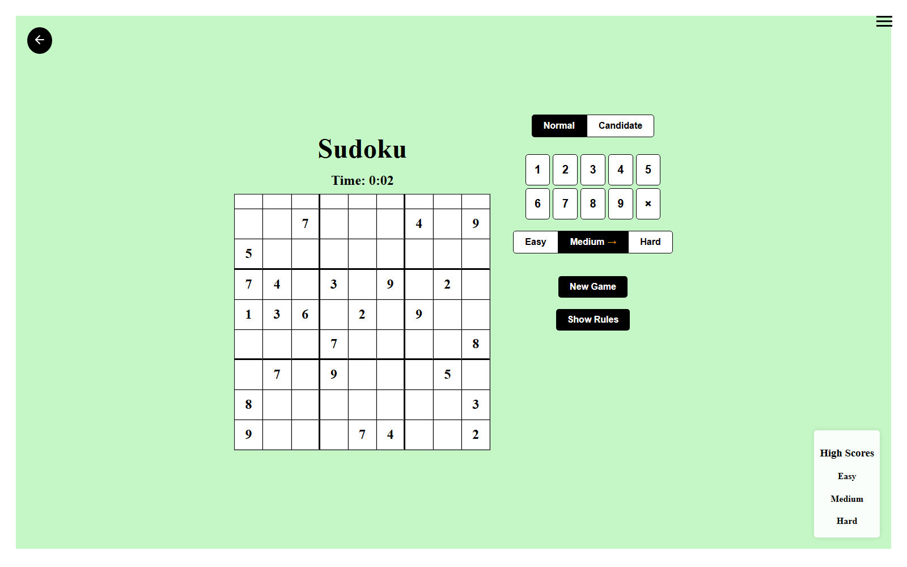
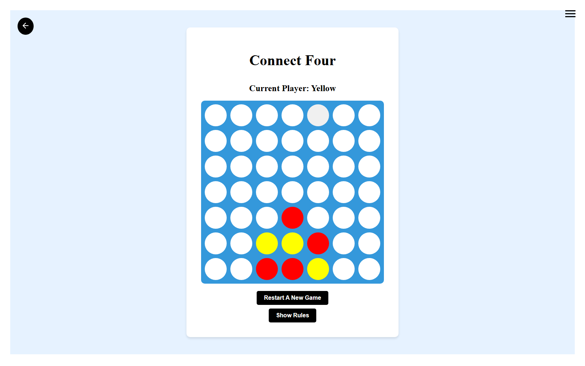
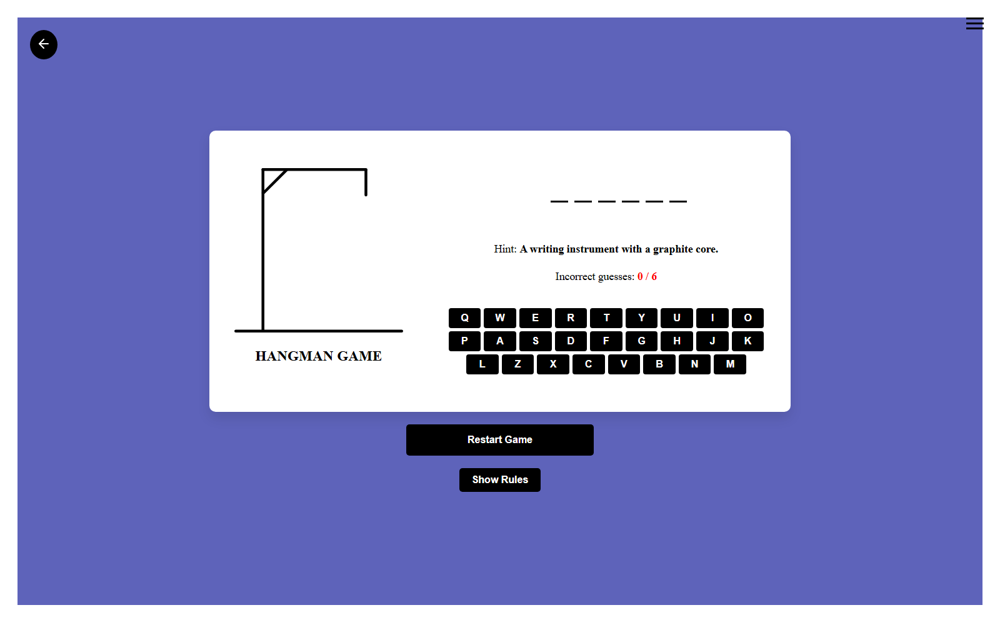

# React Game Portal

A collage of small browser games in one React + Vite app — pick a card on the home page and play. Ten games, one shared shell (routing, menu, GSAP-driven page transitions).

**Live:** [rein-gameportal.netlify.app](https://rein-gameportal.netlify.app)

## Games

Snake & Ladder · Tic Tac Toe · Bingo · Typing Test · Hangman · Rock Paper Scissors · Connect Four · Mines · Sudoku · Ludo

## Screenshots

| Home | Mines |
|---|---|
|  |  |

| Sudoku | Connect Four |
|---|---|
|  |  |

| Hangman |
|---|
|  |

## Stack

- **Framework:** React 18, Vite, React Router
- **Animation:** GSAP, React Spring, react-confetti
- **UI:** styled-components, Swiper, lucide-react / react-icons
- **Deployment:** Netlify

## Run locally

```bash
npm install
npm run dev
```
